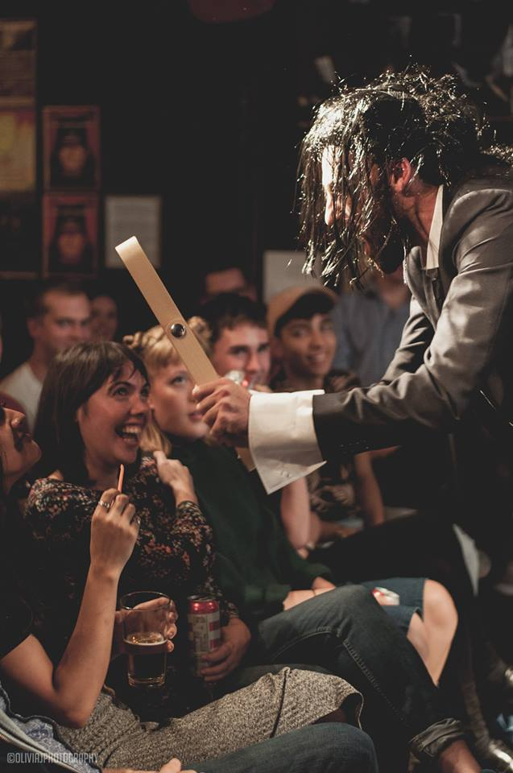
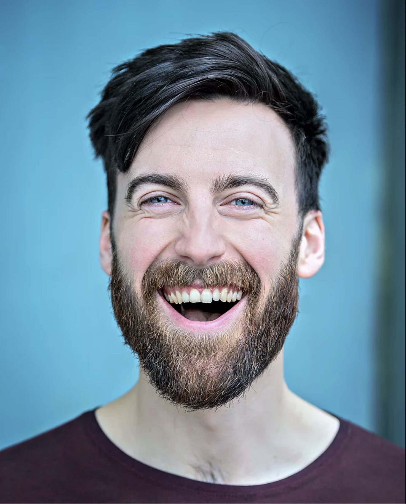
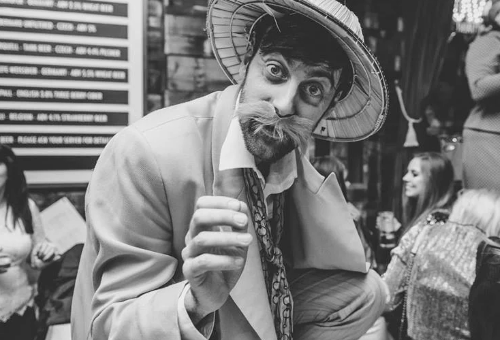

Charlie Hammond is an actor and clown.

He has performed throughout the UK, in theatres, on the streets, in cabaret clubs and late-night performance spaces.

He is also at times a writer, director and facilitator, working with artists and to shape and develop their work.

From 2015 - 2016 he was Associate Director to Cal McCrystal for Giffords Circus.

Charlie is currently training to become a qualified Giggle Doctor, working with Theodora's Children Charity.

He is based in Sheffield.

## Contact

For those who are interested here is my [Résumé](assets/pdf/resume.pdf){:target="\_blank"}

Here is my live performance [Showreel](){:target="\_blank"}

Here is my acting [Showreel](){:target="\_blank"}

Or chats, advice, thoughts, and feelings, hit me up at:

[charliemhammond@gmail.com](mailto:charliemhammond@gmail.com)

Upcoming gigs can be found on the socials

[Facebook](){:target="\_blank"}
[Twitter](){:target="\_blank"}
